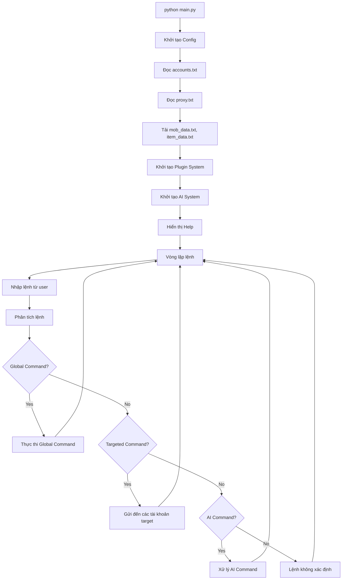
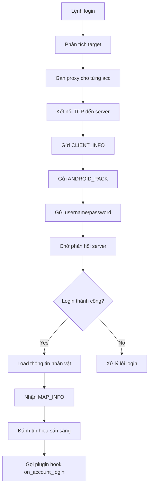
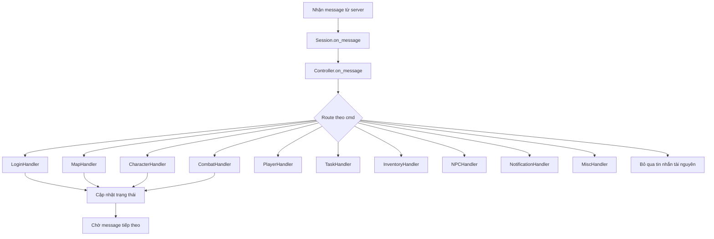
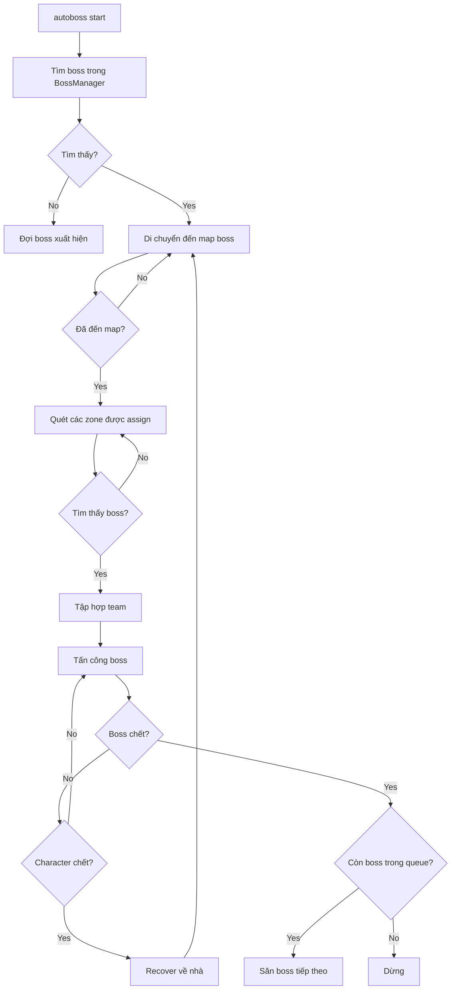
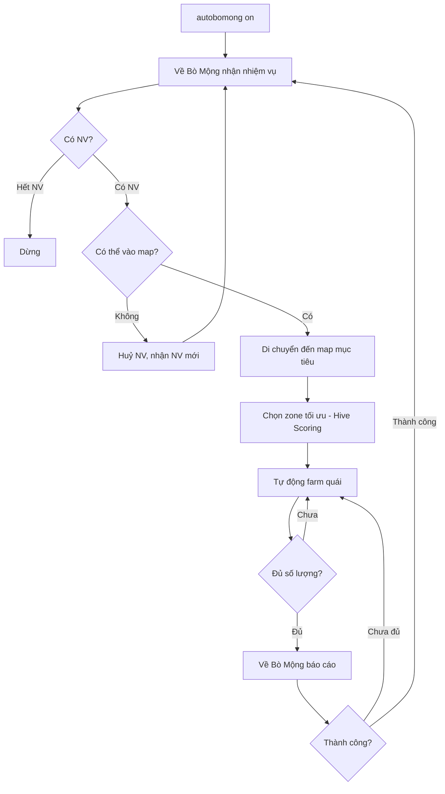
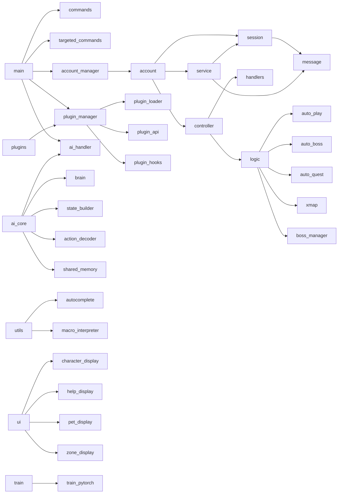

# ClientNRO - Bot Ngọc Rồng Online

> **Version:** 1.2.0 | **Platform:** Windows/Linux | **Language:** Python 3.10+

**ClientNRO** là một trình điều khiển (bot) dòng lệnh đa tài khoản dành cho game **Ngọc Rồng Online** (Dragon Ball Online - NRO). Dự án cho phép quản lý, tự động hóa các tác vụ trong game cho nhiều tài khoản cùng lúc với hệ thống plugin mở rộng, tích hợp AI (Neural Network) và hỗ trợ macro scripting.

---

## 📑 Mục lục

- [Tổng quan dự án](#1-tổng-quan-dự-án)
- [Cấu trúc thư mục](#2-cấu-trúc-thư-mục)
- [Hướng dẫn cài đặt](#3-hướng-dẫn-cài-đặt)
- [Hướng dẫn sử dụng](#4-hướng-dẫn-sử-dụng)
- [Danh sách toàn bộ Commands / Tools](#5-danh-sách-toàn-bộ-commands--tools)
  - [Global Commands (Quản lý hệ thống)](#51-global-commands-quản-lý-hệ-thống)
  - [Targeted Commands (Lệnh gửi đến tài khoản)](#52-targeted-commands-lệnh-gửi-đến-tài-khoản)
  - [Macro System (Ngôn ngữ Macro riêng)](#53-macro-system-ngôn-ngữ-macro-riêng---combo)
  - [AI System Commands](#54-ai-system-commands)
- [Danh sách tính năng](#6-danh-sách-tính-năng)
- [Luồng hoạt động hệ thống](#7-luồng-hoạt-động-hệ-thống)
- [Cấu hình nâng cao](#8-cấu-hình-nâng-cao)
- [Troubleshooting](#9-troubleshooting)
- [Dành cho Developer](#10-dành-cho-developer)
- [API và Internal Functions](#11-api-và-internal-functions)
- [Changelog](#12-changelog)

---

## 1. Tổng quan dự án

### 🎯 Mục đích

ClientNRO được xây dựng nhằm mục đích tự động hóa các thao tác trong game Ngọc Rồng Online, cho phép người dùng:

- Quản lý và điều khiển **nhiều tài khoản cùng lúc** (lên đến 1000+)
- Tự động hóa các tác vụ: đánh quái, làm nhiệm vụ, săn boss, train đệ tử
- Hỗ trợ **proxy rotation** để vượt giới hạn IP
- Tích hợp **AI Neural Network** cho quyết định thông minh
- Hệ thống **Plugin** cho phép mở rộng chức năng
- **Macro scripting** với biến, vòng lặp, điều kiện
- **Multi-account coordination** săn boss theo nhóm có chia zone

### 🏗️ Kiến trúc tổng quát

```
┌─────────────────────────────────────────────────────────┐
│                    CLI Interface (main.py)               │
├──────────────┬─────────────┬─────────────┬───────────────┤
│   Commands   │  Targeted   │   Plugins   │   AI System   │
│  (global)    │  Commands   │  (extend)   │  (Neural Net) │
├──────────────┴──────┬──────┴──────┬──────┴───────────────┤
│    AccountManager   │  Controller │   Logic Services     │
│   (multi-account)   │ (message    │  (auto_play, auto_   │
│                     │ routing)    │   boss, auto_quest)  │
├─────────────────────┴──────┬──────┴─────────────────────┤
│         Network Layer (Session/Message/Service)          │
│              (Kết nối game server)                       │
└──────────────────────────────────────────────────────────┘
```

### 🧩 Các module quan trọng

| Module | Vai trò |
|--------|---------|
| `core/account_manager.py` | Quản lý danh sách tài khoản, groups, mục tiêu lệnh |
| `core/account.py` | Đối tượng tài khoản đơn lẻ, login/reconnect |
| `network/session.py` | Kết nối TCP đến game server, mã hóa/giải mã |
| `network/service.py` | Gửi các gói tin service (di chuyển, tấn công, chat...) |
| `controller/controller.py` | Định tuyến message từ server đến các handler |
| `logic/auto_play.py` | Tự động đánh quái với skill selection |
| `logic/auto_boss.py` | State machine săn boss (tìm, scan zone, attack) |
| `logic/auto_NVBoMong.py` | Auto quest hàng ngày (Bò Mộng) |
| `logic/xmap.py` | Dijkstra pathfinding di chuyển giữa các map |
| `plugins/base_plugin.py` | Base class cho plugin system |
| `ai_core/brain.py` | Pure Python Neural Network inference engine |
| `utils/macro_interpreter.py` | Trình thông dịch macro (biến, vòng lặp) |

---

## 2. Cấu trúc thư mục

```
ClientNRO/
├── main.py                          # Entry point - vòng lặp CLI chính
├── config.py                        # Cấu hình mặc định (class Config)
├── accounts.txt                     # Danh sách tài khoản (user:pass)
├── proxy.txt                        # Danh sách proxy
├── maps_config.json                 # Dữ liệu map cho AutoQuest
│
├── core/
│   ├── account.py                   # Lớp Account - quản lý 1 session game
│   └── account_manager.py           # AccountManager - quản lý nhiều tài khoản
│
├── network/
│   ├── message.py                   # Message - đóng gói dữ liệu mạng
│   ├── reader.py                    # Reader - đọc binary data từ server
│   ├── writer.py                    # Writer - ghi binary data
│   ├── session.py                   # Session - kết nối TCP, mã hóa key
│   └── service.py                   # Service - gửi các gói tin game
│
├── controller/
│   ├── controller.py                # Controller - định tuyến message
│   └── handlers/
│       ├── base_handler.py          # BaseHandler - abstract base class
│       ├── login_handler.py         # Xử lý login, server list
│       ├── character_handler.py     # Xử lý thông tin nhân vật
│       ├── map_handler.py           # Xử lý bản đồ, waypoints, zones
│       ├── combat_handler.py        # Xử lý chiến đấu (mob HP, chết)
│       ├── player_handler.py        # Xử lý người chơi khác
│       ├── task_handler.py          # Xử lý nhiệm vụ
│       ├── inventory_handler.py     # Xử lý túi đồ, rương, pet info
│       ├── npc_handler.py           # Xử lý NPC chat, menu
│       ├── notification_handler.py  # Xử lý thông báo, boss detection
│       └── misc_handler.py          # Xử lý các message còn lại
│
├── commands/                        # CLI Global Commands
│   ├── base_command.py              # Abstract base class
│   ├── command_loader.py            # Auto-load commands từ folder
│   ├── login_command.py             # login <idx|all|default|group>
│   ├── logout_command.py            # logout <idx|all|group>
│   ├── list_command.py              # list - liệt kê tài khoản
│   ├── target_command.py            # target <idx|group>
│   ├── group_command.py             # group create/delete/add/remove/list
│   ├── proxy_command.py             # proxy list
│   ├── plugin_command.py            # plugin list/enable/disable/reload/info
│   ├── config_command.py            # config reload/get/set
│   ├── exit_command.py              # exit/thoát
│   ├── clear_command.py             # cls/clear
│   ├── help_command.py              # help
│   ├── combo_command.py             # combo <macro_name>
│   ├── sleep_command.py             # sleep <giây>
│   ├── wait_command.py              # wait <giây>
│   └── autologin_command.py         # autologin on/off
│
├── targeted_commands/               # Lệnh gửi đến account cụ thể
│   ├── base_targeted_command.py     # Abstract base class
│   ├── targeted_command_loader.py   # Auto-load
│   ├── show_command.py              # show / show boss / show balo / ...
│   ├── pet_command.py               # pet info/follow/protect/attack/home
│   ├── findmob_command.py           # findmob
│   ├── findboss_command.py          # findboss
│   ├── findnpc_command.py           # findnpc
│   ├── gomap_command.py             # gomap <id|home>
│   ├── khu_command.py               # khu / khu <id>
│   ├── teleport_command.py          # teleport <x> <y>
│   ├── teleportnpc_command.py       # teleportnpc <id>
│   ├── opennpc_command.py           # opennpc <id> [menu...]
│   ├── hit_command.py               # hit - tấn công 1 lần
│   ├── useitem_command.py           # useitem <id> [số lượng]
│   ├── andau_command.py             # andau - ăn đậu
│   ├── congcs_command.py            # congcs <hp> <mp> <sd>
│   ├── tansat_command.py            # tansat start/off/clear/list/<id>
│   ├── autoplay_command.py          # autoplay on/off/add/remove/list
│   ├── autopet_command.py           # autopet on/off
│   ├── autoattack_command.py        # autoattack on/off/target/clear
│   ├── autoitem_command.py          # autoitem on/off/status
│   ├── autoboss_command.py          # autoboss add/start/stop/queue...
│   ├── autobomong_command.py        # autobomong on/off/status
│   ├── autoquest_command.py         # autoquest on/off
│   ├── automsm_command.py           # automsm banthan/detu/stop
│   ├── scanmap_command.py           # scanmap <start> <end> | stop
│   ├── aiagent_command.py           # aiagent on/off/status/train/save
│   ├── tapchat_command.py           # tapchat <msg>
│   ├── logger_command.py            # logger on/off
│   ├── blacklist_command.py         # blacklist
│   ├── tansat_command.py            # tansat (đã liệt kê ở trên)
│   └── ...
│
├── logic/                           # Logic nghiệp vụ tự động hóa
│   ├── auto_play.py                 # Auto attack loop (skill selection)
│   ├── auto_attack.py               # Auto attack service (priority target)
│   ├── auto_boss.py                 # Boss hunting state machine
│   ├── auto_pet.py                  # Auto pet leveling
│   ├── auto_item.py                 # Auto item usage (interval)
│   ├── auto_main_quest.py           # Auto main quest (dựa trên maps_config)
│   ├── auto_NVBoMong.py             # Auto quest Bò Mộng (hàng ngày)
│   ├── auto_giftcode.py             # Auto nhập giftcode
│   ├── auto_msm.py                  # Auto nâng sức mạnh (MSM)
│   ├── auto_scanmap.py              # Auto quét map -> maps_config.json
│   ├── xmap.py                      # Pathfinding (Dijkstra) giữa các map
│   ├── map_data.py                  # Dữ liệu map ID <-> Tên
│   ├── npc_names.py                 # Tên NPC theo template ID
│   ├── boss_manager.py              # Singleton quản lý boss xuất hiện
│   ├── quest_mapper.py              # Map nhiệm vụ -> Boss tương ứng
│   └── target_utils.py              # Target utilities (focus)
│
├── ai_core/                         # AI Neural Network System
│   ├── brain.py                     # InferenceEngine (pure Python MLP)
│   ├── state_builder.py             # StateBuilder (game state -> 60D vector)
│   ├── action_decoder.py            # ActionDecoder (AI action -> game cmd)
│   ├── shared_memory.py             # SharedMemory (multi-agent coordination)
│   ├── online_training.py           # Online training integration
│   ├── shared_training.py           # Shared training (multi-agent)
│   └── weights/                     # Thư mục chứa weights
│       └── default_weights.json     # Weights mặc định
│
├── plugins/                         # Plugin System
│   ├── base_plugin.py               # BasePlugin (ABC)
│   ├── plugin_api.py                # PluginAPI (interface cho plugin)
│   ├── plugin_hooks.py              # PluginHooks (event system)
│   ├── plugin_loader.py             # PluginLoader (discover & load)
│   ├── plugin_manager.py            # PluginManager (lifecycle)
│   ├── user_plugins/                # Thư mục chứa plugins người dùng
│   │   ├── auto_chat_plugin.py      # AutoChatPlugin (tự động chat)
│   │   └── __init__.py
│   ├── PLUGIN_COMMANDS.md           # Hướng dẫn sử dụng plugin commands
│   ├── QUICKSTART.md                # Quick start cho plugin
│   └── README.md                    # Hướng dẫn phát triển plugin
│
├── utils/
│   ├── autocomplete.py              # CLI autocomplete (Tab, history)
│   └── macro_interpreter.py         # Macro interpreter (var, while, print)
│
├── ui/                              # Display modules
│   ├── __init__.py                  # Re-export tất cả functions
│   ├── character_display.py         # Hiển thị thông tin nhân vật
│   ├── help_display.py              # Hiển thị help menu
│   ├── pet_display.py               # Hiển thị thông tin đệ tử
│   ├── task_display.py              # Hiển thị nhiệm vụ
│   ├── item_display.py              # Hiển thị items
│   ├── zone_display.py              # Hiển thị zone list, boss list
│   ├── formatters.py                # Hàm format số (short_number)
│   ├── pet_status.py                # Trạng thái đệ tử
│   ├── table_headers.py             # Headers cho compact tables
│   └── table_utils.py               # Utilities cho table rendering
│
├── config_system/                   # Advanced JSON config system
│   ├── config_loader.py             # ConfigLoader singleton
│   ├── config_validator.py          # ConfigValidator (schema validation)
│   └── default.json                 # Cấu hình mặc định (JSON)
│
├── constants/
│   └── cmd.py                       # Cmd - mã lệnh game server
│
├── config/
│   └── auto_chat.json               # Cấu hình AutoChat plugin
│
├── data/
│   ├── item_data.txt                # Dữ liệu item (ID -> Tên)
│   └── mob_data.txt                 # Dữ liệu quái (ID -> Tên)
│
├── macros/                          # Macro files
│   ├── setup_all.txt                # Macro setup tất cả tài khoản
│   ├── chia_khu.txt                 # Macro chia khu tự động
│   └── test.txt                     # Macro test
│
├── logs/
│   └── logger_config.py             # Cấu hình logging (màu sắc, format)
│
├── model/
│   ├── game_objects.py              # Data models: Char, Mob, Item, Skill...
│   ├── map_objects.py               # TileMap, Waypoint
│   └── pet.py                       # Pet data model (phiên bản cũ)
│
├── services/
│   ├── movement.py                  # MovementService (teleport, move)
│   └── pet_service.py               # Pet service (phiên bản cũ)
│
├── handlers/
│   └── ai_command_handler.py        # AI Command Handler (ai status/on/off/...)
│
├── train/
│   └── train_pytorch.py             # PyTorch training script
│
├── scripts/
│   └── analyze_project.py           # Phân tích cấu trúc project -> JSON
│
├── tests/                           # Unit tests
│   ├── test_ai_commands.py          # Test AI commands
│   ├── test_ai_pipeline.py          # Test AI pipeline
│   ├── test_login.py                # Test login flow
│   └── debug_boss_match.py          # Debug boss matching
│
├── requirements-train.txt           # Dependencies cho PyTorch training
├── .gitignore
└── README.md                        # Bạn đang đọc nó đây!
```

---

## 3. Hướng dẫn cài đặt

### Yêu cầu hệ thống

- **Hệ điều hành:** Windows 10+ / Linux (Ubuntu 20.04+)
- **Python:** 3.10 trở lên
- **Kết nối Internet:** Ổn định (càng nhiều tài khoản càng cần băng thông)
- **RAM:** Tối thiểu 512MB (cơ bản) - 4GB+ (nếu dùng AI + nhiều tài khoản)

### Cài đặt

#### Bước 1: Clone hoặc tải project

```bash
git clone <repository-url>
cd ClientNRO
```

#### Bước 2: Tạo virtual environment (khuyến nghị)

```bash
# Windows
python -m venv venv
venv\Scripts\activate

# Linux
python3 -m venv venv
source venv/bin/activate
```

#### Bước 3: Cài đặt dependencies

```bash
pip install -r requirements.txt
```

> **Lưu ý:** Hiện tại project chưa có file `requirements.txt` riêng. Các thư viện cần thiết là **Python standard library** (không cần cài thêm). Nếu muốn sử dụng AI Training với PyTorch:

```bash
pip install -r requirements-train.txt
```

#### Bước 4: Cấu hình tài khoản

Tạo file `accounts.txt` với định dạng:

```
username1:password1
username2:password2
username3:password3
```

Mỗi dòng một tài khoản, username và password cách nhau bằng dấu `:`.

#### Bước 5: Cấu hình proxy (tùy chọn)

Tạo file `proxy.txt` với định dạng:

```
ip:port:user:pass
ip2:port2:user2:pass2
```

Hoặc:

```
http://user:pass@ip:port
```

#### Bước 6: Chạy bot

```bash
python main.py
```

---

## 4. Hướng dẫn sử dụng

### Màn hình chính

Khi khởi động, bạn sẽ thấy giao diện CLI với prompt:

```
[None]> 
```

- `[None]` = chưa chọn mục tiêu
- `[Acc 0]` = đang nhắm đến tài khoản index 0
- `[Group 'all']` = đang nhắm đến nhóm 'all'

### Luồng sử dụng cơ bản

1. **Login tài khoản** - `login all` hoặc `login 0` hoặc `login default`
2. **Chọn mục tiêu** - `target 0` hoặc `target all`
3. **Xem trạng thái** - `show`
4. **Bật tự động** - `autoplay on`, `autopet on`
5. **Di chuyển** - `gomap 5` hoặc `khu 1`
6. **Xem danh sách lệnh** - `help`

### Các tab chức năng chính

| Chức năng | Mô tả | Khi nào sử dụng |
|-----------|-------|-----------------|
| **Quản lý tài khoản** | Login, logout, list, target, group | Khi cần quản lý nhiều acc |
| **Đánh quái tự động** | autoplay, autoattack, tansat | Khi cần farm quái |
| **Săn Boss** | autoboss, findboss, show boss | Khi boss xuất hiện |
| **Nhiệm vụ** | autobomong, autoquest, show nhiemvu | Làm daily quest |
| **Đệ tử** | autopet, pet info, pet attack | Khi train pet |
| **Di chuyển** | gomap, khu, teleport, teleportnpc | Khi cần đi đâu đó |
| **Plugin** | plugin list/enable/disable | Khi cần mở rộng chức năng |
| **Macro** | combo <tên> | Khi chạy kịch bản tự động |
| **AI** | ai on/off, aiagent | Khi dùng neural network |

---

## 5. Danh sách toàn bộ Commands / Tools

### 5.1 Global Commands (Quản lý hệ thống)

Các lệnh được xử lý trực tiếp bởi `main.py` và `commands/`.

---

#### `login`

**Mô tả:** Đăng nhập tài khoản vào game.

**Cách sử dụng:**
```
login              # Login mặc định (theo Config.DEFAULT_LOGIN)
login all          # Login tất cả tài khoản
login <index>      # Login tài khoản theo index (VD: login 0)
login default      # Login danh sách mặc định
login <group>      # Login theo nhóm
login 0,1,2        # Login danh sách index
```

**Tính năng đặc biệt:**
- Tự động **phân phối proxy** (cứ 4 acc / proxy, 5 acc / IP local)
- Hỗ trợ **LOGIN_BLACKLIST** (bỏ qua tài khoản trong blacklist)
- Tự động bỏ qua tài khoản đã online

---

#### `logout`

**Mô tả:** Đăng xuất tài khoản.

**Cách sử dụng:**
```
logout             # Logout mục tiêu hiện tại
logout all         # Logout tất cả
logout <index>     # Logout tài khoản index
logout <group>     # Logout theo nhóm
logout 0,1,2       # Logout danh sách
```

---

#### `target`

**Mô tả:** Chọn mục tiêu để gửi lệnh.

**Cách sử dụng:**
```
target <index>     # target 0 (chọn acc index 0)
target all         # target all (chọn tất cả)
target <group>     # target my_group (chọn nhóm)
```

---

#### `group`

**Mô tả:** Quản lý nhóm tài khoản.

**Cách sử dụng:**
```
group list                        # Xem danh sách nhóm
group create <name> <ids>         # Tạo nhóm (VD: group create n1 0,1,2)
group delete <name>               # Xóa nhóm
group add <name> <ids>            # Thêm thành viên
group remove <name> <ids>         # Xóa thành viên
```

---

#### `list`

**Mô tả:** Liệt kê tất cả tài khoản và trạng thái (Online/Offline/Reconnect), proxy.

---

#### `proxy`

**Mô tả:** Xem thông tin proxy đang sử dụng.

**Cách sử dụng:**
```
proxy list    # Hiển thị danh sách proxy + usage bars
```

---

#### `plugin`

**Mô tả:** Quản lý plugin system.

**Cách sử dụng:**
```
plugin list              # Liệt kê tất cả plugins
plugin enable <name>     # Bật plugin
plugin disable <name>    # Tắt plugin
plugin reload <name>     # Reload plugin
plugin info <name>       # Xem thông tin chi tiết
```

---

#### `config`

**Mô tả:** Quản lý cấu hình (hot-reload).

**Cách sử dụng:**
```
config reload            # Tải lại file cấu hình
config get <key>         # Xem giá trị (VD: server.host)
config set <key> <val>   # Đặt giá trị (tạm thời)
```

---

#### `combo`

**Mô tả:** Chạy macro từ file trong thư mục `macros/`.

**Cách sử dụng:**
```
combo <tên_macro>    # Chạy macro
```

---

#### `help`

**Mô tả:** Hiển thị menu trợ giúp với tất cả các lệnh.

---

#### `autologin`

**Mô tả:** Bật/tắt tự động đăng nhập lại khi mất kết nối.

**Cách sử dụng:**
```
autologin on     # Bật
autologin off    # Tắt
```

---

#### `exit`

**Mô tả:** Thoát chương trình, dừng tất cả tài khoản.

---

#### `clear` / `cls`

**Mô tả:** Xóa màn hình.

---

#### `sleep`

**Mô tả:** Tạm dừng CLI (dùng trong macro).

**Cách sử dụng:**
```
sleep 1.5    # Dừng 1.5 giây
```

---

#### `wait`

**Mô tả:** Chờ trong macro.

**Cách sử dụng:**
```
wait 2.0    # Chờ 2 giây
```

---

### 5.2 Targeted Commands (Lệnh gửi đến tài khoản)

Các lệnh được gửi đến mục tiêu (`target`) đang chọn. Nếu target là nhiều tài khoản, hiển thị ở chế độ compact.

---

#### `show`

**Mô tả:** Hiển thị thông tin nhân vật.

**Cách sử dụng:**
```
show                     # Thông tin cơ bản (HP, MP, SM, vị trí...)
show csgoc               # Chỉ số GỐC (HP gốc, MP gốc, SĐ gốc)
show boss                # Danh sách Boss đã xuất hiện (global)
show nhiemvu             # Thông tin nhiệm vụ
show balo                # Item trong hành trang và rương
show mobs                # Danh sách quái trong map hiện tại
show finfomap            # Thông tin chi tiết map
```

---

#### `pet`

**Mô tả:** Quản lý đệ tử.

**Cách sử dụng:**
```
pet info                 # Xem thông tin đệ tử
pet follow               # Đi theo
pet protect              # Bảo vệ
pet attack               # Tấn công
pet home                 # Về nhà
```

---

#### `autoplay`

**Mô tả:** Bật/tắt tự động đánh quái.

**Cách sử dụng:**
```
autoplay on              # Bật
autoplay off             # Tắt
autoplay add <id>        # Thêm ID quái vào danh sách
autoplay remove <id>     # Xóa ID quái khỏi danh sách
autoplay list            # Xem danh sách quái đang đánh
```

**Điều kiện hoạt động:** Cần có quái trong map, nhân vật còn sống.

---

#### `autoattack`

**Mô tả:** Bật/tắt Auto Attack (priority target system).

**Cách sử dụng:**
```
autoattack on            # Bật
autoattack off           # Tắt
autoattack target        # Tìm mục tiêu
autoattack clear         # Xóa target
```

---

#### `autopet`

**Mô tả:** Bật/tắt tự động train đệ tử.

**Cách sử dụng:**
```
autopet on               # Bật
autopet off              # Tắt
```

**Cơ chế:**
- Tự động cho đệ tử ăn đậu thần (item ID 595) khi thể lực < 50
- Tự động ra lệnh bảo vệ mỗi khi bật

---

#### `autoitem`

**Mô tả:** Tự động sử dụng item theo chu kỳ (30 phút).

**Cách sử dụng:**
```
autoitem on <item_id>    # Bật với item ID
autoitem off             # Tắt
autoitem status          # Xem trạng thái
```

---

#### `autoboss`

**Mô tả:** Hệ thống săn boss tự động (state machine).

**Cách sử dụng:**
```
autoboss add <tên>       # Thêm boss vào queue (hỗ trợ fuzzy)
autoboss start <tên>     # Bắt đầu săn boss
autoboss stop            # Dừng
autoboss status          # Xem trạng thái hiện tại
autoboss clear           # Xóa queue
autoboss list            # Danh sách queue
autoboss queue           # Bắt đầu queue mode
```

**Các trạng thái trong state machine:**
```
SEARCHING -> NAVIGATING -> ZONE_SCANNING -> GATHERING -> ATTACKING
                                                              |
                                                              v
                                                        RECOVERING (nếu chết)
```

**Tính năng nổi bật:**
- **Hive Zone Distribution:** Chia zone cho nhiều bot săn cùng boss
- **Role-based:** HUNTER (chủ quest), SUPPORTER (hỗ trợ)
- **Queue Mode:** Săn nhiều boss theo danh sách
- **Nhường boss:** Supporter tự động dừng đánh khi boss HP < 5%

---

#### `autobomong`

**Mô tả:** Tự động làm nhiệm vụ hàng ngày (Bò Mộng - Siêu khó).

**Cách sử dụng:**
```
autobomong on            # Bật
autobomong off           # Tắt
autobomong status        # Xem trạng thái + thống kê
```

**Các bước tự động:**
1. Về map Bò Mộng (47)
2. Mở menu -> Nhiệm vụ hàng ngày -> Siêu khó
3. Di chuyển đến map có quái mục tiêu
4. Chọn zone tối ưu (Hive Scoring)
5. Tự động đánh quái (Autoplay)
6. Đếm số quái đã giết
7. Về báo cáo khi đủ số lượng
8. Nhận nhiệm vụ mới (tự động lặp)

---

#### `autoquest`

**Mô tả:** Tự động làm nhiệm vụ chính (dựa trên `maps_config.json`).

**Cách sử dụng:**
```
autoquest on             # Bật
autoquest off            # Tắt
```

---

#### `automsm`

**Mô tả:** Tự động nâng giới hạn sức mạnh (MSM).

**Cách sử dụng:**
```
automsm banthan          # Nâng cho bản thân
automsm detu             # Nâng cho đệ tử
automsm stop             # Dừng
```

**Cơ chế:**
- Di chuyển đến Vách núi Moori (Map 43)
- Mở menu Quốc vương -> Nâng sức mạnh
- Tự động xin vàng khi hết vàng
- Tự động tắt khi đạt giới hạn

---

#### `gomap`

**Mô tả:** Di chuyển đến bản đồ (sử dụng XMap pathfinding).

**Cách sử dụng:**
```
gomap <id>               # Di chuyển đến map ID (VD: gomap 5)
gomap home               # Về nhà
gomap stop               # Dừng di chuyển
```

---

#### `khu`

**Mô tả:** Quản lý khu vực (zone).

**Cách sử dụng:**
```
khu                      # Hiển thị danh sách khu vực
khu <id>                 # Chuyển đến khu vực
```

---

#### `teleport`

**Mô tả:** Dịch chuyển tức thời đến tọa độ.

**Cách sử dụng:**
```
teleport <x> <y>         # Di chuyển đến tọa độ (VD: teleport 100 200)
teleport npc <id>        # Di chuyển đến NPC
```

---

#### `teleportnpc`

**Mô tả:** Dịch chuyển đến NPC.

**Cách sử dụng:**
```
teleportnpc <id>         # Di chuyển đến NPC template ID
```

---

#### `opennpc`

**Mô tả:** Mở menu NPC và chọn tùy chọn.

**Cách sử dụng:**
```
opennpc <id>             # Mở menu NPC
opennpc <id> <menu...>   # Mở và chọn menu (VD: opennpc 17 1 4)
```

---

#### `findmob`

**Mô tả:** Tìm kiếm quái trong map hiện tại.

---

#### `findnpc`

**Mô tả:** Liệt kê NPC trong map hiện tại.

---

#### `findboss`

**Mô tả:** Tìm boss trong map hiện tại.

---

#### `hit`

**Mô tả:** Tấn công quái vật gần nhất (một lần).

---

#### `useitem`

**Mô tả:** Sử dụng item trong hành trang.

**Cách sử dụng:**
```
useitem <id> [số_lượng]  # Dùng item
```

---

#### `andau`

**Mô tả:** Ăn đậu thần hồi HP/MP khi HP < 80% hoặc MP < 80%.

---

#### `congcs`

**Mô tả:** Tự động cộng chỉ số tiềm năng.

**Cách sử dụng:**
```
congcs <hp> <mp> <sd>    # Cộng đến mục tiêu (VD: congcs 100 200 50)
congcs stop              # Dừng
```

---

#### `tansat`

**Mô tả:** Quản lý tàn sát — đây là alias/wrapper cho `autoplay` với cơ chế filter mob type. Khi thêm ID quái, `autoplay` sẽ chỉ tấn công các quái có template ID đó. Hoạt động dựa trên `autoplay.start()` với `target_mobs` được set.

**Cách sử dụng:**
```
tansat start             # Kích hoạt tàn sát (tương đương autoplay on)
tansat off               # Tắt
tansat clear             # Xóa danh sách ID ưu tiên
tansat list              # Xem danh sách ID đang set
tansat <id>              # Thêm template ID quái vào danh sách ưu tiên (VD: tansat 25)
```

**Tham số:** `<id>` — template ID của quái (số nguyên, ví dụ 25 = Khủng long)

**Điều kiện hoạt động:** Cần bật `autoplay` hoặc `tansat start` trước. Nếu không có ID nào được thêm, sẽ tấn công tất cả quái.

---

#### `scanmap`

**Mô tả:** Quét quái vật và lưu vào `maps_config.json`.

**Cách sử dụng:**
```
scanmap <start> <end>    # Quét từ map start đến end
scanmap stop             # Dừng
```

---

#### `tapchat`

**Mô tả:** Gửi tin nhắn chat trong game.

**Cách sử dụng:**
```
tapchat <nội_dung>       # Chat nội dung
```

---

#### `logger`

**Mô tả:** Bật/tắt logging.

**Cách sử dụng:**
```
logger on                # Bật log
logger off               # Tắt log
```

---

#### `blacklist`

**Mô tả:** Quản lý blacklist.

---

#### `aiagent`

**Mô tả:** Điều khiển AI Agent trên từng tài khoản.

**Cách sử dụng:**
```
aiagent on               # Bật AI
aiagent off              # Tắt AI
aiagent status           # Xem trạng thái
aiagent train            # Training
aiagent save             # Lưu weights
```

---

### 5.3 Macro System (Ngôn ngữ Macro riêng - Combo)

> **Đây là ngôn ngữ macro riêng của ClientNRO**, được thiết kế để tạo kịch bản tự động hóa phức tạp. Macro có biến, vòng lặp `while`, biểu thức Python, biến hệ thống, và có thể gọi bất kỳ lệnh game nào.

#### 5.3.1 Tổng quan

Macro là các file text đặt trong thư mục `macros/`, phần mở rộng `.txt`, `.macro`, hoặc không có extension. Chạy macro bằng lệnh `combo`:

```
combo <tên_macro>
```

Ví dụ:
```
combo test          # Chạy macros/test.txt
combo setup_all     # Chạy macros/setup_all.txt
combo chia_khu      # Chạy macros/chia_khu.txt
```

#### 5.3.2 Cấu trúc file Macro

Mỗi dòng trong file macro là một **lệnh**. Có 2 loại lệnh:

| Loại | Mô tả |
|------|-------|
| **Logic Command** | Lệnh điều khiển luồng: `var`, `set`, `print`, `while`/`endwhile` |
| **Game Command** | Bất kỳ lệnh nào không phải logic command — sẽ được gửi đến game dưới dạng targeted command |

**Comment:** Dòng bắt đầu bằng `#` (ở đầu dòng hoặc giữa dòng sau lệnh).

```text
# Đây là comment
var x 10  # Inline comment cũng được
```

---

#### 5.3.3 Danh sách Logic Commands

##### `var <tên_biến> <giá_trị>` — Khai báo biến

Khai báo biến mới với giá trị khởi tạo. Giá trị là một **biểu thức** (expression) được tính toán ngay.

```text
var count 10
var name "Hello"
var hp 1000
var zone (int(i) + 1) % 20
var is_online online_count > 0
```

**Giá trị mặc định:** Kiểu dữ liệu tự động theo Python (int, float, str, bool).

---

##### `set <tên_biến> <biểu_thức>` — Gán giá trị mới

Cập nhật giá trị biến đã tồn tại. Biểu thức được đánh giá giống như `var`.

```text
set i int(i) + 1         # Tăng i lên 1
set total online_count   # Gán bằng số lượng online
set name "Acc " + str(i) # Ghép chuỗi
```

---

##### `print <nội_dung>` — In ra màn hình

In thông báo ra console, hỗ trợ `${}` substitution.

```text
print Đang xử lý tài khoản ${i}...
print Tổng cộng ${count} tài khoản
print Giá trị hp = ${hp}
```

---

##### `while <điều_kiện>` / `endwhile` — Vòng lặp

Vòng lặp với điều kiện — thực thi khối lệnh bên trong cho đến khi điều kiện sai.

```text
var i 0
while int(i) < 5
    target ${i}
    print Đang xử lý acc ${i}
    set i int(i) + 1
endwhile
```

**Cơ chế:**
- Điều kiện được đánh giá mỗi lần lặp lại
- Hỗ trợ lồng nhau (while bên trong while) — dùng skip_block với nesting count
- Nếu điều kiện sai ngay từ đầu, bỏ qua toàn bộ khối lệnh

---

#### 5.3.4 Biểu thức (Expression Engine)

Mọi giá trị trong `var`, `set`, `while` đều được đánh giá qua **expression engine** của Python. Điều này cho phép:

**Phép toán số học:**
```text
var total (int(a) + int(b)) * 2
var result round(3.14159 * 2)
var remainder int(x) % int(y)
```

**Phép so sánh (dùng trong while):**
```text
while int(i) < int(count)
while int(x) >= 0
while str(name) != "done"
```

**Hàm có sẵn:**

| Hàm | Mô tả | Ví dụ |
|-----|-------|-------|
| `int(x)` | Chuyển sang số nguyên | `int("10")` |
| `float(x)` | Chuyển sang số thực | `float("3.14")` |
| `str(x)` | Chuyển sang chuỗi | `str(100)` |
| `len(x)` | Độ dài (chuỗi/list) | `len("hello")` |
| `abs(x)` | Giá trị tuyệt đối | `abs(-5)` |
| `round(x)` | Làm tròn số | `round(3.7)` |
| `math.*` | Toàn bộ module math | `math.floor(3.9)`, `math.ceil(2.1)`, `math.pow(2, 3)` |
| `random.*` | Toàn bộ module random | `random.randint(1, 10)`, `random.choice([1,2,3])` |

**Lưu ý:** Trong biểu thức, bạn có thể dùng trực tiếp **tên biến** thay vì `${tên_biến}`.

```text
var i 0
var count 10
# Trong while, dùng i và count trực tiếp
while int(i) < int(count)
    target ${i}
    set i int(i) + 1
endwhile
```

---

#### 5.3.5 Biến Hệ Thống (System Variables)

Các biến đặc biệt được lấy từ `AccountManager` thông qua biến `${...}` trong lệnh game hoặc qua context trong expression engine.

| Biến | Kiểu | Mô tả |
|------|------|-------|
| `${online_count}` | int | Số tài khoản đang online trong `AccountManager` |
| `${total_count}` | int | Tổng số tài khoản trong hệ thống |
| `${map_zone_count}` | int | Số zone (khu) trong map hiện tại (mặc định 20 nếu không lấy được) |

**Trong expression engine**, các biến này cũng có sẵn dưới dạng tên biến trực tiếp:
```text
var half_online int(online_count) / 2
while int(i) < int(total_count)
```

---

#### 5.3.6 `${...}` Variable Substitution

**Trong các lệnh game** và `print`, bạn dùng cú pháp `${tên_biến}` để chèn giá trị biến vào câu lệnh.

```text
# Biến tự định nghĩa
var zone_id 5
khu ${zone_id}              # -> khu 5

# Biến hệ thống
print Có ${online_count} acc online

# Ghép biến + text
var msg Đây là acc số
tapchat ${msg} ${i}          # -> tapchat Đây là acc số 0

# Biểu thức phức tạp trong substitution
var zone (int(i) + int(start)) % int(total_zones)
khu ${zone}
```

---

#### 5.3.7 Game Commands (Lệnh game trong Macro)

**Bất kỳ lệnh nào không phải logic command đều được gửi đến game** như một targeted command. Bạn có thể dùng tất cả các lệnh đã liệt kê ở mục **5.2 Targeted Commands** và **5.1 Global Commands**.

Các lệnh game thường dùng trong macro:

| Lệnh | Mô tả |
|------|-------|
| `target <idx/all/group>` | Chọn mục tiêu cho lệnh tiếp theo |
| `login` | Đăng nhập tài khoản (hiện tại/gợi ý) |
| `khu <id>` | Chuyển khu vực |
| `gomap <id>` | Di chuyển đến map |
| `tapchat <msg>` | Chat trong game |
| `pet attack` | Ra lệnh pet tấn công |
| `pet info` | Xem thông tin pet |
| `useitem <id>` | Dùng item |
| `show` | Xem thông tin nhân vật |
| `hit` | Tấn công 1 lần |
| `wait <s>` | Chờ trong macro |
| `sleep <s>` | Tạm dừng |
| `autoplay on` | Bật auto đánh quái |
| `autopet on` | Bật auto train pet |

---

#### 5.3.8 Ví dụ Macro thực tế

##### Ví dụ 1: `test.txt` — Macro cơ bản

```text
# Sample Macro
# Usage: combo test

print Chuẩn bị test combo...
set delay 1.5

# Chat sequence
print Đang chat...
tapchat Xin chào
wait ${delay}
tapchat Tôi đang dùng macro
wait ${delay}

# Di chuyển (commented out)
# gomap 5
# wait 5.0
# hit

print Hoàn tất!
```

**Mục đích:** Kiểm tra macro cơ bản với biến, print, chat.

---

##### Ví dụ 2: `setup_all.txt` — Setup tất cả tài khoản

```text
target all
login
autopet on
useitem 595
target 1
khu 1
target 2
khu 2
target 3
khu 3
target 4
khu 4
target all
pet attack
show
pet info
```

**Mục đích:** Login tất cả tài khoản, bật autopet, dùng đậu thần, chia khu riêng cho từng acc (acc 1 -> khu 1, acc 2 -> khu 2...), ra lệnh pet tấn công, show thông tin.

---

##### Ví dụ 3: `chia_khu.txt` — Chia khu tự động cho N tài khoản (có vòng lặp, biến, biểu thức)

Đây là macro mạnh nhất, minh họa đầy đủ sức mạnh của ngôn ngữ macro:

```text
# Macro chia khu tự động
# Tự động chuyển mỗi account sang một khu khác nhau

var i 0
# Số lượng tài khoản muốn chia
var count online_count

# Lấy thông tin khu vực hiện tại
print [Macro] Đang lấy thông tin khu vực...
khu
wait 2.0

# Tổng số khu vực trong map
var total_zones map_zone_count
print [Macro] Tìm thấy ${total_zones} khu vực.

# Khu vực bắt đầu (mặc định khu 0)
var start_zone 0

print Bắt đầu chia khu cho ${count} tài khoản...

while int(i) < int(count)
    # Chọn mục tiêu là tài khoản thứ i
    target ${i}

    # Tính toán khu vực (acc 0 -> khu 0, acc 1 -> khu 1...)
    # Sử dụng phép chia lấy dư (%) để quay vòng nếu hết khu
    var zone (int(i) + int(start_zone)) % int(total_zones)

    print [Macro] Chuyển Acc ${i} sang Khu ${zone}

    # Thực hiện lệnh
    khu ${zone}

    # Chờ 1 xíu để server xử lý
    wait 1.0

    # Tăng biến đếm
    set i int(i) + 1
endwhile

print Hoàn tất chia khu!
# Reset target về tất cả
target all
```

**Phân tích từng dòng của macro `chia_khu.txt`:**

| Dòng | Loại | Giải thích |
|------|------|------------|
| `var i 0` | Logic | Khởi tạo biến đếm `i = 0` |
| `var count online_count` | Logic | Lấy số acc đang online từ biến hệ thống |
| `khu` | Game | Gửi lệnh `khu` để lấy danh sách zone |
| `wait 2.0` | Game | Chờ server trả về danh sách zone |
| `var total_zones map_zone_count` | Logic | Lấy số lượng zone từ biến hệ thống |
| `print ... ${total_zones} ...` | Logic | In ra console thông báo |
| `while int(i) < int(count)` | Logic | Vòng lặp: chạy đến khi `i >= count` |
| `target ${i}` | Game | Chọn target là acc thứ `i` |
| `var zone ... % ...` | Logic | Tính zone cho acc thứ `i` (có vòng tránh) |
| `khu ${zone}` | Game | Chuyển acc thứ `i` sang zone đã tính |
| `wait 1.0` | Game | Chờ server xử lý |
| `set i int(i) + 1` | Logic | Tăng i lên 1 |
| `endwhile` | Logic | Kết thúc vòng lặp, quay lại kiểm tra điều kiện |
| `target all` | Game | Reset target về tất cả |

---

#### 5.3.9 Luồng thực thi Macro

```mermaid
flowchart TD
    Start[User gõ: combo chia_khu] --> Load[ComboCommand load file macros/chia_khu.txt]
    Load --> Parse[Tạo MacroInterpreter với danh sách dòng]
    Parse --> Step[Gọi next_command()]
    Step --> IsLogic{Logic Command?}
    IsLogic -->|var/set/print| Execute[Thực thi ngay, không yield]
    IsLogic -->|while/endwhile| Control[Điều khiển luồng (loop stack)]
    IsLogic -->|Không| Yield[Yield game command ra ngoài]
    Execute --> Step
    Control --> Step
    Yield --> MainLoop[main.py nhận lệnh, gửi đến account]
    MainLoop --> Done[Lệnh hoàn tất, gọi next_command() lần nữa]
    Done --> IsFinished{PC hết dòng?}
    IsFinished -->|Chưa| Step
    IsFinished -->|Hết| Exit[Macro kết thúc]
```

**Cơ chế hoạt động:**
1. `combo <tên>` tạo `MacroInterpreter` với Program Counter (`pc = 0`)
2. `main.py` lưu `current_macro` và gọi `next_command()` mỗi lần
3. Logic commands (`var`, `set`, `print`, `while`, `endwhile`) được xử lý **nội bộ** và `continue` (không yield ra ngoài)
4. Game commands (bất kỳ dòng nào còn lại) được yield ra ngoài cho main loop thực thi
5. Mỗi lần game command hoàn tất, `main.py` gọi `next_command()` lần nữa
6. Khi Program Counter vượt quá số dòng, macro kết thúc (`finished = True`)

---

#### 5.3.10 Toàn bộ ngôn ngữ Macro (DSL Reference)

**Syntax tổng quát (BNF-like):**

```ebnf
macro         = { comment | logic_cmd | game_cmd }
logic_cmd     = var_cmd | set_cmd | print_cmd | while_block
var_cmd       = "var" identifier expression
set_cmd       = "set" identifier expression
print_cmd     = "print" string_with_substitution
while_block   = "while" expression "\n" { macro } "endwhile"
game_cmd      = any_text_with_substitution
comment       = "#" any_text "\n"
expression    = python_expression_or_literal
substitution  = "${" identifier "}"
```

**Bảng tham chiếu nhanh:**

| Cú pháp | Loại | Ví dụ |
|---------|------|-------|
| `# ...` | Comment | `# Đây là comment` |
| `var x expr` | Khai báo biến | `var count online_count` |
| `set x expr` | Gán biến | `set i int(i) + 1` |
| `print msg` | In console | `print Đang xử lý acc ${i}` |
| `while cond` | Bắt đầu vòng lặp | `while int(i) < int(count)` |
| `endwhile` | Kết thúc vòng lặp | `endwhile` |
| `${var}` | Substitution | `khu ${zone}` |
| `int(x)` | Hàm chuyển int | `int(i) + int(start_zone)` |
| `float(x)` | Hàm chuyển float | `float("3.14")` |
| `str(x)` | Hàm chuyển str | `str(100)` |
| `len(x)` | Hàm độ dài | `len("hello")` |
| `abs(x)` | Giá trị tuyệt đối | `abs(-5)` |
| `round(x)` | Làm tròn | `round(3.7)` |
| `math.*` | Module math | `math.floor(3.9)` |
| `random.*` | Module random | `random.randint(1,10)` |

**Biến hệ thống:**

| Biến | Cách dùng |
|------|-----------|
| `online_count` | `var n online_count` hoặc `${online_count}` |
| `total_count` | `var n total_count` hoặc `${total_count}` |
| `map_zone_count` | `var z map_zone_count` hoặc `${map_zone_count}` |

---

#### 5.3.11 Khi nào nên dùng Macro?

| Tình huống | Giải pháp |
|------------|-----------|
| Cần setup hàng loạt acc sau khi login | Macro `setup_all.txt` |
| Cần chia khu cho nhiều acc | Macro `chia_khu.txt` với vòng lặp |
| Cần chạy chuỗi lệnh tuần tự | Macro với `wait` giữa các lệnh |
| Cần chat tự động theo kịch bản | Macro với `tapchat` và `wait` |
| Cần phối hợp nhiều acc săn boss | Macro với `target` và vòng lặp |
| Cần kiểm tra hàng loạt | Macro với `show`, `pet info` |

---

#### 5.3.12 Troubleshooting Macro

| Vấn đề | Nguyên nhân | Khắc phục |
|--------|------------|-----------|
| `Macro 'xxx' not found` | File không tồn tại | Kiểm tra file trong `macros/`, đúng extension `.txt`/`.macro` |
| Macro chạy 1 lần rồi dừng | Hết dòng, hoặc `while` sai điều kiện | Thêm `print` để debug giá trị biến |
| `Macro Eval Error` | Lỗi biểu thức Python | Kiểm tra cú pháp expression, dùng `int()`, `str()` đúng chỗ |
| Macro treo (loop vô hạn) | Điều kiện while luôn đúng | Kiểm tra `set i ...` có chạy không, debug với `print` |
| Biến `${x}` ra rỗng | Biến chưa được khai báo | Dùng `var x ...` trước khi dùng |
| Lệnh game không có hiệu lực | Sai cú pháp hoặc chưa chọn target | Kiểm tra `target` trước lệnh game |

---

### 5.4 AI System Commands

Hệ thống AI sử dụng Neural Network để điều khiển bot.

**Cách sử dụng:**
```
ai status                # Xem trạng thái AI system
ai info                  # Xem thông tin model
ai on                    # Bật AI (global)
ai off                   # Tắt AI (global)
ai toggle                # Toggle AI
ai load <path>           # Load weights từ file
ai reset                 # Reset về weights mặc định
ai goal set <type> <params>  # Set mục tiêu
ai goal show             # Xem mục tiêu hiện tại
ai goal clear            # Xóa mục tiêu
ai group set <ids>       # Set active groups
ai group show            # Xem group assignments
ai group assign <id> <gid>  # Assign account vào group
ai group auto            # Auto-assign
ai zone auto <map_id>    # Auto-distribute zones
ai zone show <map_id>    # Xem zone distribution
ai team leader           # Xem/set team leader
ai team formation        # Xem team formation
ai trainer shared on/off # Bật/tắt shared training
```

---

## 6. Danh sách tính năng

### Auto Farm

| Tính năng | File | Mô tả |
|-----------|------|-------|
| **Auto Play** | `logic/auto_play.py` | Tự động tìm quái, teleport đến, chọn skill mạnh nhất và tấn công liên tục. Hỗ trợ lọc theo mob template ID. |
| **Auto Attack** | `logic/auto_attack.py` | Priority target system: nearest, boss_first, name_match. Auto retarget khi target chết. |
| **Tàn Sát** | `targeted_commands/tansat_command.py` | Filter mob type, chỉ tấn công loại quái đã chọn. |

### Auto Train

| Tính năng | File | Mô tả |
|-----------|------|-------|
| **Auto Pet** | `logic/auto_pet.py` | Tự động cho đệ tử ăn đậu thần khi thể lực thấp, ra lệnh bảo vệ/tấn công. |
| **Auto MSM** | `logic/auto_msm.py` | Tự động nâng giới hạn sức mạnh (MSM) cho bản thân hoặc đệ tử. |

### Auto Quest

| Tính năng | File | Mô tả |
|-----------|------|-------|
| **Auto Quest Bò Mộng** | `logic/auto_NVBoMong.py` | Làm nhiệm vụ hàng ngày (Siêu khó) hoàn toàn tự động: nhận -> farm -> báo cáo -> lặp. Hỗ trợ Hive Scoring để chọn zone. |
| **Auto Main Quest** | `logic/auto_main_quest.py` | Tự động làm nhiệm vụ chính dựa trên maps_config.json. Anti-stuck, blacklist mob bị lỗi. |
| **Auto Giftcode** | `logic/auto_giftcode.py` | Tự động nhập danh sách giftcode cho tài khoản. |

### Auto Boss

| Tính năng | File | Mô tả |
|-----------|------|-------|
| **Auto Boss Core** | `logic/auto_boss.py` | State machine săn boss: SEARCHING -> NAVIGATING -> ZONE_SCANNING -> GATHERING -> ATTACKING |
| **Boss Detection** | `controller/handlers/notification_handler.py` | Phát hiện boss từ các kênh chat (VIP, Server, Map). |
| **Boss Manager** | `logic/boss_manager.py` | Singleton quản lý boss đã xuất hiện, trạng thái Sống/Chết. |
| **Quest Mapper** | `logic/quest_mapper.py` | Map nhiệm vụ -> Boss tương ứng. |
| **Boss Queue** | `logic/auto_boss.py` | Queue nhiều boss, săn tuần tự. |
| **Hive Coordination** | `logic/auto_boss.py` | Chia zone cho nhiều bot săn cùng boss, round-robin. |

### Auto Pet / Đệ tử

| Tính năng | File | Mô tả |
|-----------|------|-------|
| **Pet Info** | `controller/handlers/inventory_handler.py` | Đọc thông tin đệ tử từ server. |
| **Auto Feed** | `logic/auto_pet.py` | Tự động cho đệ tử ăn đậu khi thể lực < 50. |
| **Pet Command** | `targeted_commands/pet_command.py` | Điều khiển trạng thái đệ tử. |

### Auto Inventory

| Tính năng | File | Mô tả |
|-----------|------|-------|
| **Auto Item** | `logic/auto_item.py` | Sử dụng item theo chu kỳ 30 phút. |
| **Auto Eat Bean** | `controller/handlers/inventory_handler.py` | Ăn đậu khi HP/MP < 80%. |
| **Use Item** | `targeted_commands/useitem_command.py` | Sử dụng item từ hành trang. |

### Auto Map

| Tính năng | File | Mô tả |
|-----------|------|-------|
| **XMap Pathfinding** | `logic/xmap.py` | Dijkstra algorithm tìm đường đi ngắn nhất giữa các map. Hỗ trợ đi bộ, NPC teleport, Capsule. |
| **Auto Scan Map** | `logic/auto_scanmap.py` | Tự động quét map và lưu dữ liệu quái vào maps_config.json. |
| **Zone Management** | `controller/handlers/map_handler.py` | Xem danh sách zone, đổi zone, đánh giá mật độ. |
| **Waypoint Navigation** | `services/movement.py` | Điều hướng qua waypoints, cổng chuyển map. |

### Auto Combat

| Tính năng | File | Mô tả |
|-----------|------|-------|
| **Combat Handler** | `controller/handlers/combat_handler.py` | Xử lý MOB_HP, NPC_DIE, NPC_LIVE, PLAYER_ATTACK_NPC. |
| **Skill Selection** | `logic/auto_play.py` | Tự động chọn skill mạnh nhất dựa trên cooldown, mana. |
| **Death Recovery** | `controller/handlers/player_handler.py` | Tự động revive, về nhà, quay lại map farm. |

### Plugin System

| Tính năng | File | Mô tả |
|-----------|------|-------|
| **Plugin Manager** | `plugins/plugin_manager.py` | Load, enable, disable, reload plugins. |
| **Plugin API** | `plugins/plugin_api.py` | API cho plugin: accounts, config, logging, commands, events. |
| **Event Hooks** | `plugins/plugin_hooks.py` | on_account_login, on_account_logout, on_mob_killed, on_level_up... |
| **Auto Chat Plugin** | `plugins/user_plugins/auto_chat_plugin.py` | Plugin mẫu: tự động chat khi login. |

### AI System

| Tính năng | File | Mô tả |
|-----------|------|-------|
| **Inference Engine** | `ai_core/brain.py` | Pure Python MLP (60->64->64->32), zero dependencies. |
| **State Builder** | `ai_core/state_builder.py` | Convert game state -> 60D vector (3 frames x 20D temporal context). |
| **Action Decoder** | `ai_core/action_decoder.py` | 32 actions: basic, multi-agent, boss hunting, goal-based. |
| **Shared Memory** | `ai_core/shared_memory.py` | Multi-agent coordination: targets, groups, zones, goals. |
| **Online Training** | `ai_core/online_training.py` | Learn while playing, reward-based. |
| **Shared Training** | `ai_core/shared_training.py` | Centralized training từ nhiều agents. |
| **Zone Density Manager** | `ai_core/shared_memory.py` | Hive scoring: chọn zone tối ưu dựa trên mật độ bot và người chơi. |

### Utility Features

| Tính năng | File | Mô tả |
|-----------|------|-------|
| **Autocomplete** | `utils/autocomplete.py` | Tab completion, lịch sử lệnh, gợi ý tham số (plugin, macro, NPC). |
| **Macro Interpreter** | `utils/macro_interpreter.py` | Biến, vòng lặp while, biểu thức Python, biến hệ thống. |
| **Logger Color** | `logs/logger_config.py` | Log màu sắc theo level, box drawing. |
| **Proxy Rotation** | `commands/login_command.py` | Phân phối proxy (4 acc/proxy, 5 acc/IP). |
| **Auto Login** | `config.py` | AUTO_LOGIN: tự động reconnect khi mất kết nối. |

---

## 7. Luồng hoạt động hệ thống

### 7.1 Luồng khởi động



### 7.2 Luồng Login



### 7.3 Luồng Message Handling



### 7.4 Luồng Auto Boss



### 7.5 Luồng Auto Quest Bò Mộng



### 7.6 Luồng XMap Pathfinding

```mermaid
flowchart TD
    Start[gomap <id>] --> Dijkstra[Tìm đường đi ngắn nhất - Dijkstra]
    Dijkstra --> Path[Tìm thấy đường đi]
    Path --> Step[Thực hiện bước tiếp theo]
    Step --> Type{Loại di chuyển?}
    Type -->|Waypoint| Waypoint[Đi bộ qua cổng]
    Type -->|NPC| NPC[Đối thoại với NPC]
    Type -->|Walk| Walk[Đi bộ đến tọa độ]
    Type -->|Item| Item[Dùng item (Capsule)]
    Type -->|Capsule| Capsule[Dùng Capsule]
    Waypoint --> Check{Đã đến map tiếp?}
    NPC --> Check
    Walk --> Check
    Item --> Check
    Capsule --> Check
    Check -->|Chưa| Timeout{Timeout?}
    Timeout -->|Có| Recalc[Tính toán lại đường đi]
    Timeout -->|Không| Step
    Recalc --> Dijkstra
    Check -->|Đã đến| AtTarget{Đã đến đích?}
    AtTarget -->|Chưa| Step
    AtTarget -->|Đã đến| Done[Hoàn thành]
```

---

## 8. Cấu hình nâng cao

### 8.1 Config Class (`config.py`)

Các biến cấu hình chính trong class `Config`:

| Biến | Kiểu | Mặc định | Mô tả |
|------|------|----------|-------|
| `HOST` | str | `"103.245.255.222"` | Địa chỉ server game |
| `PORT` | int | `12455` | Cổng kết nối |
| `VERSION` | str | `"1.2.0"` | Phiên bản tool |
| `MAX_ACCOUNTS` | int | `1000` | Số tài khoản tối đa chạy đồng thời |
| `AUTO_LOGIN` | bool | `False` | Tự động login lại khi mất kết nối |
| `DEFAULT_LOGIN` | list | `[0, 2, 3, 4, 5]` | Danh sách index login mặc định |
| `LOGIN_BLACKLIST` | list | `[]` | Danh sách username/index bỏ qua khi login all |
| `USE_LOCAL_IP_FIRST` | bool | `False` | Ưu tiên gán IP local trước proxy |
| `DEFAULT_CHAR_GENDER` | int | `1` | Giới tính nhân vật mặc định (0=TD, 1=Namek, 2=Sayda) |
| `DEFAULT_CHAR_HAIR` | int | `4` | ID tóc mặc định |
| `AI_ENABLED` | bool | `False` | Bật AI mặc định |
| `AI_WEIGHTS_PATH` | str | `"ai_core/weights/default_weights.json"` | Path đến weights |
| `AI_STATE_DIM` | int | `20` | Kích thước state vector |
| `AI_ACTION_COUNT` | int | `32` | Số lượng actions |
| `AI_DECISION_INTERVAL` | float | `0.5` | Khoảng thời gian giữa các quyết định AI |

### 8.2 JSON Config System (`config_system/default.json`)

**Đường dẫn:** `config_system/default.json`

```json
{
    "server": {
        "host": "103.245.255.222",
        "port": 12455,
        "version": "1.2.0"
    },
    "accounts": {
        "max_concurrent": 1000,
        "auto_login": false,
        "default_login": [0, 2, 3, 4, 5],
        "login_blacklist": [],
        "accounts_file": "accounts.txt"
    },
    "character": {
        "default_gender": 1,
        "default_hair": 4
    },
    "proxy": {
        "use_local_ip_first": true,
        "proxy_file": "proxy.txt"
    },
    "ai": {
        "enabled": false,
        "weights_path": "ai_core/weights/default_weights.json",
        "state_dim": 20,
        "action_count": 32,
        "decision_interval": 0.5
    },
    "plugins": {
        "enabled": true,
        "plugin_dir": "plugins",
        "auto_load": false,
        "enabled_plugins": [],
        "user_plugins_dir": "plugins/user_plugins"
    },
    "logging": {
        "level": "INFO",
        "file": "logs/client.log"
    }
}
```

#### Tác động của từng tham số:

| Key | Tác động |
|-----|----------|
| `server.host` | Địa chỉ server game cần kết nối |
| `server.port` | Cổng kết nối |
| `accounts.max_concurrent` | Giới hạn số tài khoản chạy cùng lúc. Không nên vượt quá khả năng CPU/RAM. |
| `accounts.auto_login` | Bật/tắt auto-reconnect khi mất kết nối |
| `proxy.use_local_ip_first` | `True`: 5 acc đầu dùng IP máy, sau đó mới dùng proxy. `False`: Chỉ dùng proxy. |
| `ai.enabled` | Bật AI neural network. Tắt nếu không dùng để tiết kiệm CPU. |
| `plugins.enabled` | Bật/tắt plugin system. Tắt nếu không dùng plugin. |
| `plugins.auto_load` | Tự động enable tất cả plugins khi khởi động. |
| `logging.level` | Mức độ log: DEBUG (chi tiết nhất), INFO, WARNING, ERROR |

### 8.3 Environment Variables

Hệ thống hỗ trợ override cấu hình qua biến môi trường với prefix `CLIENTNRO_`:

| Biến môi trường | Config key tương ứng |
|----------------|---------------------|
| `CLIENTNRO_SERVER_HOST` | `server.host` |
| `CLIENTNRO_SERVER_PORT` | `server.port` |
| `CLIENTNRO_AI_ENABLED` | `ai.enabled` |

### 8.4 AutoChat Config (`config/auto_chat.json`)

```json
{
    "enabled": true,
    "login_message": "Binh đoàn da xanh",
    "use_combo": true,
    "combo_delay": 1.0,
    "loop_chat": true,
    "loop_delay": 3.0,
    "combo_messages": [
        "Binh đoàn da xanh",
        "Con C",
        "Da Xanh"
    ]
}
```

### 8.5 Maps Config (`maps_config.json`)

Tự động sinh bởi `scanmap` command. Chứa danh sách map và quái trong mỗi map.

```json
{
    "maps": [
        {
            "map_id": 0,
            "map_name": "Làng Aru",
            "mobs": [
                {"mob_id": 0, "mob_name": "Mộc nhân", "count": 5},
                ...
            ]
        }
    ]
}
```

---

## 9. Troubleshooting

### 9.1 Không thể kết nối đến server

**Nguyên nhân:**
- Sai địa chỉ IP hoặc port trong config
- Server đang bảo trì
- Tường lửa chặn kết nối

**Khắc phục:**
```bash
# Kiểm tra kết nối cơ bản
ping 103.245.255.222
telnet 103.245.255.222 12455
```

### 9.2 Login thất bại

**Nguyên nhân:**
- Sai username/password
- Tài khoản bị khóa
- IP bị giới hạn (5 acc/IP)

**Khắc phục:**
- Kiểm tra lại thông tin trong `accounts.txt`
- Sử dụng proxy để vượt giới hạn IP
- Bật `USE_LOCAL_IP_FIRST = False` nếu có proxy

### 9.3 Quái không chết / Đánh không được

**Nguyên nhân:**
- Sai map (quái không có trong map hiện tại)
- Character đã chết
- Khoảng cách quá xa

**Khắc phục:**
- Dùng `show mobs` để kiểm tra quái trong map
- Dùng `show` để kiểm tra trạng thái nhân vật
- Dùng `gomap <id>` để đến đúng map

### 9.4 Map pathfinding không hoạt động

**Nguyên nhân:**
- Chưa mở map yêu cầu
- Thiếu item yêu cầu (Capsule, Nhẫn thời không)
- Map yêu cầu sức mạnh hoặc nhiệm vụ

**Khắc phục:**
- Kiểm tra sức mạnh nhân vật (yêu cầu >= 40 tỷ cho map 153+)
- Kiểm tra nhiệm vụ (cần Task ID > 24 để vào Tương Lai)
- Dùng Capsule (item 193/194) để di chuyển nhanh

### 9.5 Plugin không load

**Nguyên nhân:**
- File không nằm trong `plugins/user_plugins/`
- Class không kế thừa từ `BasePlugin`
- Syntax error

**Khắc phục:**
- Kiểm tra file trong đúng thư mục
- Xem log để biết lỗi chi tiết
- Dùng `plugin list` để kiểm tra

### 9.6 Macro không chạy

**Nguyên nhân:**
- File không có trong thư mục `macros/`
- Syntax error trong macro
- Biến không được khai báo

**Khắc phục:**
- Kiểm tra file tồn tại: `ls macros/`
- Dùng `combo <tên>` để chạy
- Kiểm tra log lỗi

### 9.7 Lỗi "Không tìm thấy dữ liệu Map" trong AutoQuest

**Nguyên nhân:**
- `maps_config.json` chưa có dữ liệu cho map đó
- Tên quái trong nhiệm vụ không khớp

**Khắc phục:**
- Chạy `scanmap <id>` để quét map
- Hoặc thêm thủ công vào `maps_config.json`

---

## 10. Dành cho Developer

### 10.1 Kiến trúc code

```
┌──────────────────────────────────────────────────────────────┐
│                     main.py (Entry point)                     │
├──────────────────────────────────────────────────────────────┤
│                     AccountManager                            │
│  ┌──────────────────┐   ┌────────────────────────────────┐   │
│  │    Account #1     │   │         Account #2             │   │
│  │  ┌──────────────┐│   │  ┌──────────────┐              │   │
│  │  │  Controller  ││   │  │  Controller  │              │   │
│  │  │  ┌──────────┐││   │  │  ┌──────────┐│              │   │
│  │  │  │ Handlers │││   │  │  │ Handlers ││              │   │
│  │  │  └──────────┘││   │  │  └──────────┘│              │   │
│  │  │  ┌──────────┐││   │  │  ┌──────────┐│              │   │
│  │  │  │ Services │││   │  │  │ Services ││              │   │
│  │  │  └──────────┘││   │  │  └──────────┘│              │   │
│  │  │  ┌──────────┐││   │  │  ┌──────────┐│              │   │
│  │  │  │  Logic   │││   │  │  │  Logic   ││              │   │
│  │  │  └──────────┘││   │  │  └──────────┘│              │   │
│  │  └──────────────┘│   │  └──────────────┘              │   │
│  └──────────────────┘   └────────────────────────────────┘   │
└──────────────────────────────────────────────────────────────┘
```

### 10.2 Dependency Graph



### 10.3 Luồng dữ liệu

```
Server TCP
    │
    ▼
Session.listen() → reader.readexactly()
    │
    ▼ Giải mã key
    │
    ▼
Controller.on_message(msg)
    │
    ├── LoginHandler.message_not_login()
    ├── LoginHandler.message_not_map()
    ├── MapHandler.process_map_info()
    ├── CharacterHandler.process_me_load_point()
    ├── CharacterHandler.process_sub_command()
    ├── CombatHandler.process_mob_hp()
    ├── CombatHandler.process_npc_die()
    ├── PlayerHandler.process_player_add()
    ├── TaskHandler.process_task_get()
    ├── InventoryHandler.process_bag_info()
    ├── NPCHandler.process_open_ui_confirm()
    └── NotificationHandler.process_server_message()
            └── boss_manager.add_boss()
```

### 10.4 Event System

**Plugin Events (PluginHooks):**

| Event | Trigger | Dữ liệu truyền |
|-------|---------|---------------|
| `on_account_login` | Account.login() thành công | `account` |
| `on_account_logout` | Account.stop() | `account` |
| `on_message_received` | Controller nhận message | `account, message` |
| `on_combat_start` | (Chưa implement) | `account, target` |
| `on_mob_killed` | (Chưa implement) | `account, mob` |
| `on_level_up` | (Chưa implement) | `account, new_level` |
| `on_item_picked` | (Chưa implement) | `account, item` |
| `on_command_executed` | Lệnh được thực thi | `command, args` |

**Async Events (asyncio.Event):**

| Event | Mục đích | Sử dụng bởi |
|-------|----------|-------------|
| `login_event` | Chờ login hoàn tất | Account.login() |
| `ui_menu_event` | Chờ menu NPC response | XMap, AutoMsm, AutoQuest |

### 10.5 Threading & Async

- **Toàn bộ ứng dụng là async** (asyncio)
- Mỗi tài khoản có vòng lặp message riêng (Session.listen)
- Các task auto (AutoPlay, AutoPet, AutoBoss, XMap) là asyncio.Tasks
- `SharedMemory` dùng `threading.Lock` cho truy cập an toàn từ nhiều coroutines
- AI Training chạy trong thread pool (`loop.run_in_executor`) để không block game loop

### 10.6 Logging System

- Sử dụng `logging` module standard
- `ColoredFormatter` hiển thị màu theo level (DEBUG, INFO, WARNING, ERROR)
- Màu ANSI cho Windows được kích hoạt qua `ctypes.windll.kernel32`
- Log level mặc định: `DEBUG`
- Có thể tắt log tạm thời qua `logger_command.py`

### 10.7 Tạo Targeted Command mới

```python
# targeted_commands/mycommand_command.py
from targeted_commands.base_targeted_command import TargetedCommand

class MycommandCommand(TargetedCommand):
    async def execute(self, account, parts, compact_mode=False, idx=None):
        # Logic xử lý
        return True, "OK"
```

Command sẽ tự động được load bởi `targeted_command_loader.py` với tên là `mycommand`.

### 10.8 Tạo Plugin mới

```python
# plugins/user_plugins/my_plugin.py
from plugins.base_plugin import BasePlugin

class MyPlugin(BasePlugin):
    def __init__(self):
        super().__init__()
        self.name = "MyPlugin"
        self.version = "1.0.0"
        self.author = "Your Name"
        self.description = "Mô tả plugin"
    
    def on_enable(self):
        super().on_enable()
        self.api.log_info("Plugin enabled!")
    
    def on_account_login(self, account):
        self.api.log_info(f"{account.username} logged in!")
```

Xem thêm: `plugins/README.md`

### 10.9 Thêm dữ liệu Map vào maps_config.json

```json
{
    "maps": [
        {
            "map_id": 5,
            "map_name": "Đảo Kame",
            "mobs": [
                {"mob_id": 25, "mob_name": "Khủng long", "count": 3},
                {"mob_id": 30, "mob_name": "Lợn lòi", "count": 5}
            ]
        }
    ]
}
```

---

## 11. API và Internal Functions

### 11.1 Core Account Management

| Class | File | Vai trò |
|-------|------|---------|
| `Account` | `core/account.py` | Quản lý 1 phiên game: login, reconnect, stop |
| `AccountManager` | `core/account_manager.py` | Quản lý nhiều tài khoản, groups, target |

### 11.2 Network Layer

| Class | File | Vai trò |
|-------|------|---------|
| `Session` | `network/session.py` | Kết nối TCP, mã hóa key, listen loop |
| `Message` | `network/message.py` | Đóng gói/gửi message |
| `Reader` | `network/reader.py` | Đọc binary data (byte, short, int, utf...) |
| `Writer` | `network/writer.py` | Ghi binary data |
| `Service` | `network/service.py` | Gửi các gói tin game service |

### 11.3 Controller & Handlers

| Class | File | Vai trò |
|-------|------|---------|
| `Controller` | `controller/controller.py` | Route message, quản lý state, toggle features |
| `BaseHandler` | `controller/handlers/base_handler.py` | Base class cho handlers |
| `LoginHandler` | `controller/handlers/login_handler.py` | Xử lý NOT_LOGIN, NOT_MAP |
| `CharacterHandler` | `controller/handlers/character_handler.py` | Xử lý thông tin nhân vật, skills, items |
| `MapHandler` | `controller/handlers/map_handler.py` | Xử lý bản đồ, waypoints, zones |
| `CombatHandler` | `controller/handlers/combat_handler.py` | Xử lý chiến đấu, mob HP, mob chết |
| `PlayerHandler` | `controller/handlers/player_handler.py` | Xử lý người chơi khác |
| `TaskHandler` | `controller/handlers/task_handler.py` | Xử lý nhiệm vụ |
| `InventoryHandler` | `controller/handlers/inventory_handler.py` | Xử lý túi đồ, rương, đệ tử |
| `NPCHandler` | `controller/handlers/npc_handler.py` | Xử lý NPC menu, chat |
| `NotificationHandler` | `controller/handlers/notification_handler.py` | Xử lý thông báo, boss detection |
| `MiscHandler` | `controller/handlers/misc_handler.py` | Xử lý các message còn lại |

### 11.4 Logic Services

| Class | File | Vai trò |
|-------|------|---------|
| `AutoPlay` | `logic/auto_play.py` | Tự động tìm quái, teleport, chọn skill, tấn công |
| `AutoAttack` | `logic/auto_attack.py` | Priority target system, auto retarget |
| `AutoBoss` | `logic/auto_boss.py` | State machine săn boss |
| `BossHuntCoordinator` | `logic/auto_boss.py` | Singleton phối hợp săn boss team |
| `AutoPet` | `logic/auto_pet.py` | Auto train đệ tử |
| `AutoItem` | `logic/auto_item.py` | Auto sử dụng item định kỳ |
| `AutoQuest` | `logic/auto_NVBoMong.py` | Auto quest Bò Mộng |
| `AutoMainQuest` | `logic/auto_main_quest.py` | Auto nhiệm vụ chính |
| `AutoGiftcode` | `logic/auto_giftcode.py` | Auto nhập giftcode |
| `AutoMsm` | `logic/auto_msm.py` | Auto nâng giới hạn sức mạnh |
| `AutoScanMap` | `logic/auto_scanmap.py` | Auto quét map |
| `XMap` | `logic/xmap.py` | Pathfinding giữa các map |
| `BossManager` | `logic/boss_manager.py` | Singleton quản lý boss |
| `QuestMapper` | `logic/quest_mapper.py` | Map quest -> boss |

### 11.5 AI System

| Class | File | Vai trò |
|-------|------|---------|
| `InferenceEngine` | `ai_core/brain.py` | Pure Python MLP inference (60->64->64->32) |
| `StateBuilder` | `ai_core/state_builder.py` | Game state -> 60D feature vector |
| `ActionDecoder` | `ai_core/action_decoder.py` | AI action -> game command (32 actions) |
| `SharedMemory` | `ai_core/shared_memory.py` | Multi-agent coordination |
| `ZoneDensityManager` | `ai_core/shared_memory.py` | Hive scoring zone selection |
| `OnlineTrainer` | `ai_core/online_training.py` | Online RL training |
| `SharedTrainer` | `ai_core/shared_training.py` | Multi-agent distributed learning |
| `AICommandHandler` | `handlers/ai_command_handler.py` | CLI commands for AI |

### 11.6 Plugin System

| Class | File | Vai trò |
|-------|------|---------|
| `BasePlugin` | `plugins/base_plugin.py` | Abstract base class cho plugin |
| `PluginAPI` | `plugins/plugin_api.py` | API interface cho plugin |
| `PluginHooks` | `plugins/plugin_hooks.py` | Event hooks system |
| `PluginLoader` | `plugins/plugin_loader.py` | Discover & load plugins |
| `PluginManager` | `plugins/plugin_manager.py` | Plugin lifecycle management |

### 11.7 Utility Services

| Class | File | Vai trò |
|-------|------|---------|
| `MovementService` | `services/movement.py` | Di chuyển, teleport, waypoint |
| `MacroInterpreter` | `utils/macro_interpreter.py` | Macro execution engine |
| `ConfigLoader` | `config_system/config_loader.py` | Singleton JSON config loader |
| `ConfigValidator` | `config_system/config_validator.py` | Schema validation |

### 11.8 Data Models

| Class | File | Vai trò |
|-------|------|---------|
| `Char` | `model/game_objects.py` | Dữ liệu nhân vật |
| `Mob` | `model/game_objects.py` | Dữ liệu quái |
| `Skill` | `model/game_objects.py` | Dữ liệu kỹ năng |
| `Item` | `model/game_objects.py` | Dữ liệu item |
| `Task` | `model/game_objects.py` | Dữ liệu nhiệm vụ |
| `Pet` | `model/game_objects.py` | Dữ liệu đệ tử (kế thừa Char) |
| `TileMap` | `model/map_objects.py` | Dữ liệu bản đồ |
| `Waypoint` | `model/map_objects.py` | Điểm chuyển map |

### 11.9 Commands

| Class | File | Vai trò |
|-------|------|---------|
| `Command` (ABC) | `commands/base_command.py` | Base class cho global commands |
| `TargetedCommand` (ABC) | `targeted_commands/base_targeted_command.py` | Base class cho targeted commands |

---

## 12. Changelog

### v1.2.0 (Hiện tại)

#### Tính năng chính

- ✅ **Multi-account management** - Quản lý lên đến 1000+ tài khoản
- ✅ **Proxy rotation** - Tự động phân phối proxy, hỗ trợ định dạng IP:PORT:USER:PASS
- ✅ **Auto Login** - Tự động đăng nhập lại khi mất kết nối
- ✅ **XMap Pathfinding** - Dijkstra algorithm tìm đường đi ngắn nhất giữa các map
- ✅ **Auto Play** - Tự động đánh quái với chọn skill thông minh
- ✅ **Auto Attack** - Priority target system (nearest, boss_first, name_match)
- ✅ **Auto Boss** - State machine săn boss với Hive coordination
- ✅ **Auto Quest Bò Mộng** - Tự động làm nhiệm vụ hàng ngày
- ✅ **Auto Main Quest** - Tự động làm nhiệm vụ chính
- ✅ **Auto Pet** - Tự động train đệ tử
- ✅ **Auto MSM** - Tự động nâng giới hạn sức mạnh
- ✅ **Auto Item** - Sử dụng item theo chu kỳ
- ✅ **Auto Scan Map** - Quét map và lưu dữ liệu
- ✅ **Plugin System** - Hệ thống plugin với event hooks
- ✅ **Macro System** - Macro scripting với biến, vòng lặp
- ✅ **AI Neural Network** - Pure Python inference engine
- ✅ **Multi-Agent AI** - Shared memory, zone distribution, team coordination
- ✅ **Auto Chat Plugin** - Plugin chat tự động khi login
- ✅ **CLI Autocomplete** - Tab completion, lịch sử lệnh

#### Tính năng đang phát triển (WIP)

- ⏳ **Auto Giftcode** - Tự động nhập danh sách giftcode
- ⏳ **Online Training** - AI học trong khi chơi
- ⏳ **Shared Training** - Distributed learning từ nhiều agents
- ⏳ **Telegram/Discord notifications** trong plugin system

#### Tính năng thử nghiệm (Experimental)

- 🧪 **Auto Boss with Queue Mode** - Săn nhiều boss theo queue
- 🧪 **Hive Zone Distribution** - Chia zone thông minh giữa nhiều bot
- 🧪 **Quest Mapper** - Tự động tìm boss từ nhiệm vụ
- 🧪 **Role-based Boss Hunting** - HUNTER / SUPPORTER

#### Ghi chú

- Dự án đang trong quá trình phát triển tích cực
- Một số tính năng có thể chưa ổn định
- Plugin system cần restart app để load plugin mới
- AI training yêu cầu cài PyTorch (xem `requirements-train.txt`)
